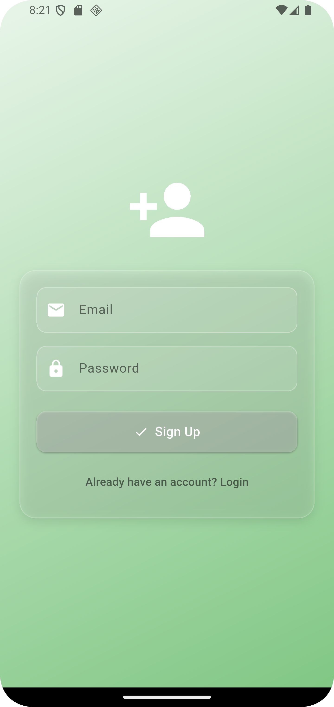
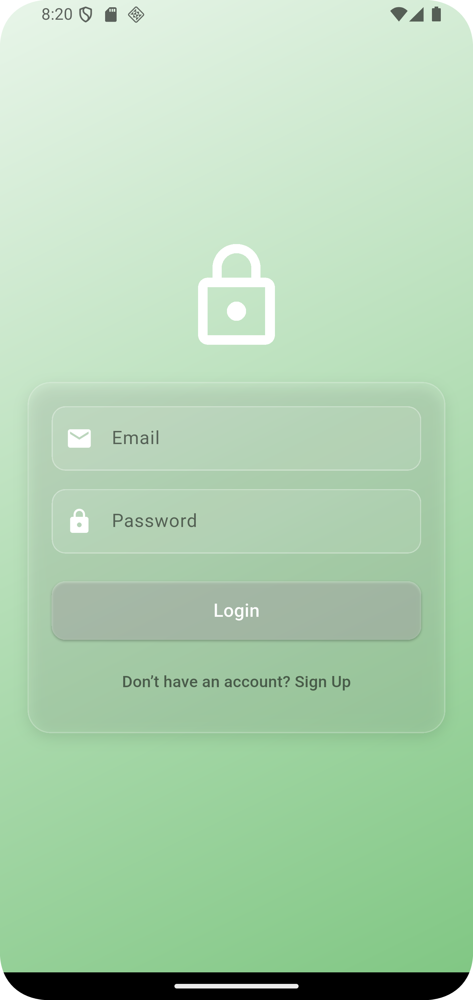
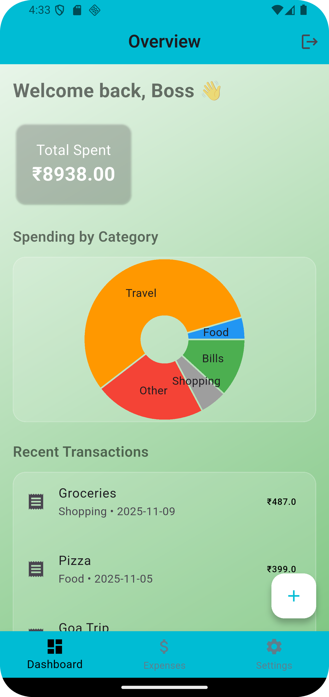
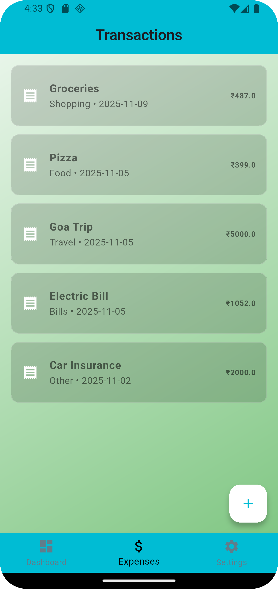
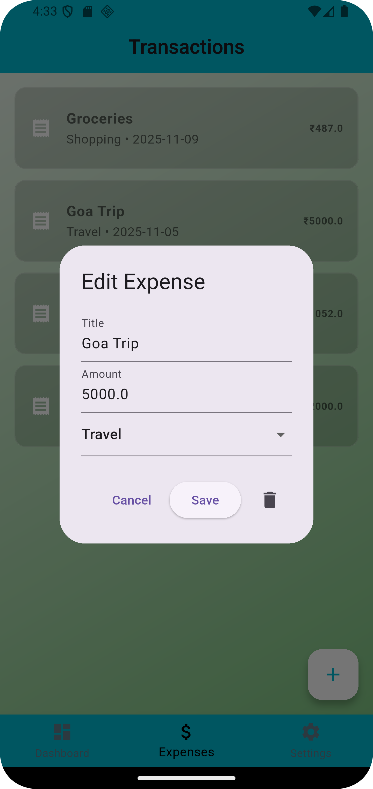
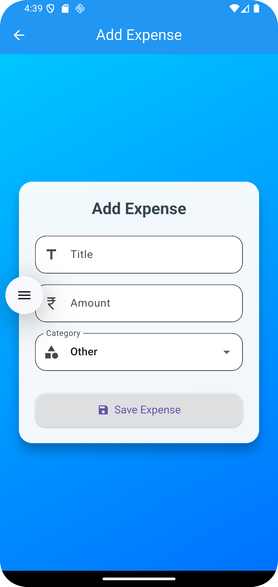
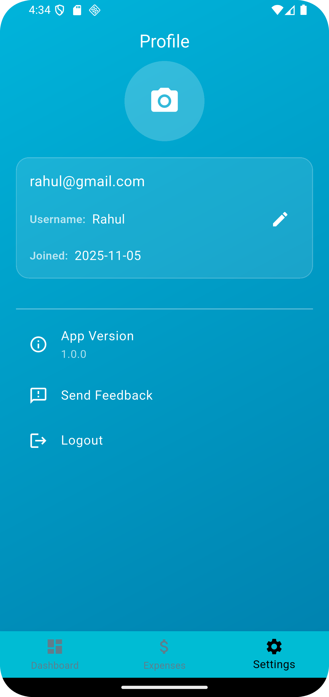

**# Expense_Tracker**

//The Expense Tracker app is a simple cross-platform mobile application built using Flutter, designed to help users monitor and manage their personal finances with ease. 
It enables users to add, view, and delete transactions, categorizing them as income or expenses. The app features a clean and responsive user interface, optimized for both Android and iOS devices,
and includes a dynamic chart that visually summarizes weekly spending patterns.While the app currently uses basic state handling,
a robust state management solution is planned for future updates to improve scalability and maintainability. This project demonstrates core Flutter concepts such as widget composition, navigation, and local data persistence, making it a solid foundation for further enhancements. 

# **//Features**

* Authentication: 
  -> Firebase Authentication is integrated for secure and scalable user login and registration.
  -> Email & password sign-up and login
  -> Form validation and error handling

* Home Screen:
  -> Overview of total expenses
  -> Interactive Pie chart showing category-wise breakdown of transactions

* Transaction Page:
  -> Add, view, and delete expenses
  -> Organized by data and category

* Profile Page:
  -> User info 
  -> Logout, feedback, etc.
   

# **//Tech Stack**

1. Flutter with Dart
2. Firebase Authentication for user management
3. Charting: fl_chart for pie chart visualization
4. Modular Architecture: Reusable widgets and clean separation of concerns

# **//Firebase Setup**

To run this project, you'll need to:

1. Create a Firebase project at firebase.google.com
2. Enable Email/Password Authentication
3. Create a Firestore database ( in test mode for development)
4. Add your google-services.json (Android)and GoogleService-Info.plist (iOS) to the respective folders
5. Make sure your firebase_options.dart is generated using the FlutterFire CLI

# **Screenshots**

## Sign-Up page

## Login page

## Home page

## Transaction page

## Edit expense

## Add expense

## Profile

